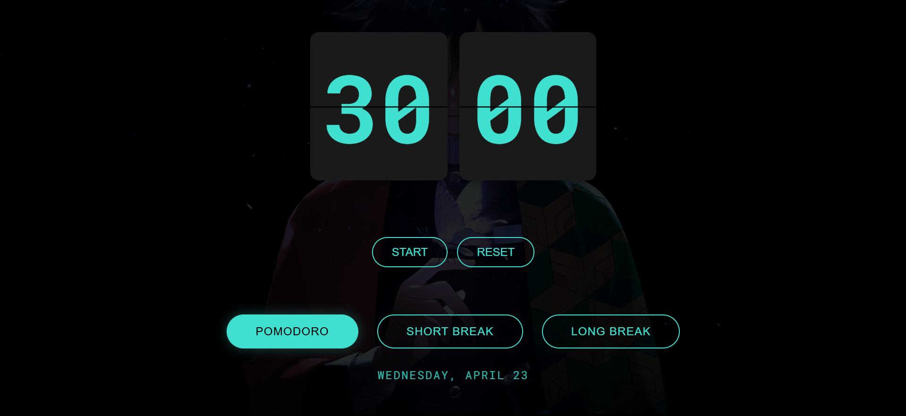

# SCI-FI-POMODORO-
# ⏳ Pomodoro Timer

A simple and sleek Pomodoro Timer built using **HTML**, **CSS**, and **JavaScript** to help you stay productive and focused with time-boxed intervals.

## 🚀 Features

- 🕒 25-minute focus sessions
- ☕ 5-minute short breaks
- 😌 15-minute long breaks
- 🔁 Auto cycle between work and break sessions
- 📱 Responsive design (works on mobile & desktop)

## 🛠️ Technologies Used

- HTML
- CSS 
- JavaScript 

## 📸 Screenshots

